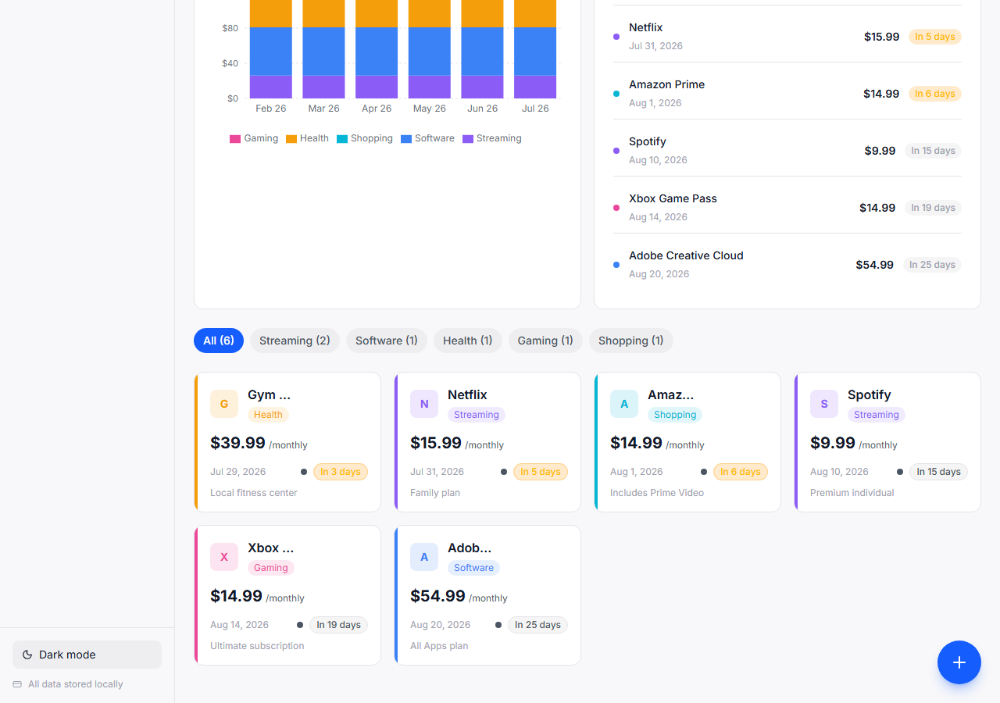
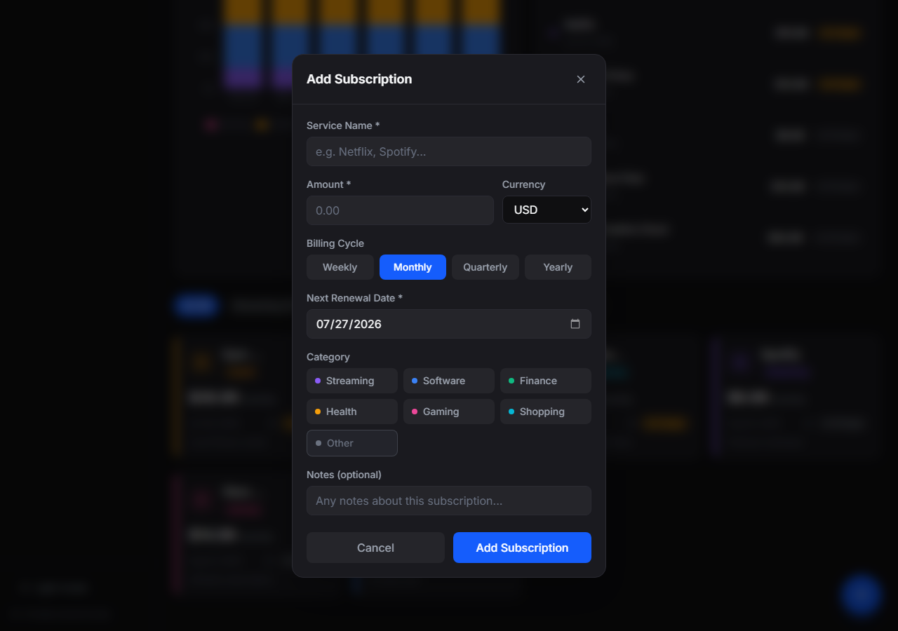
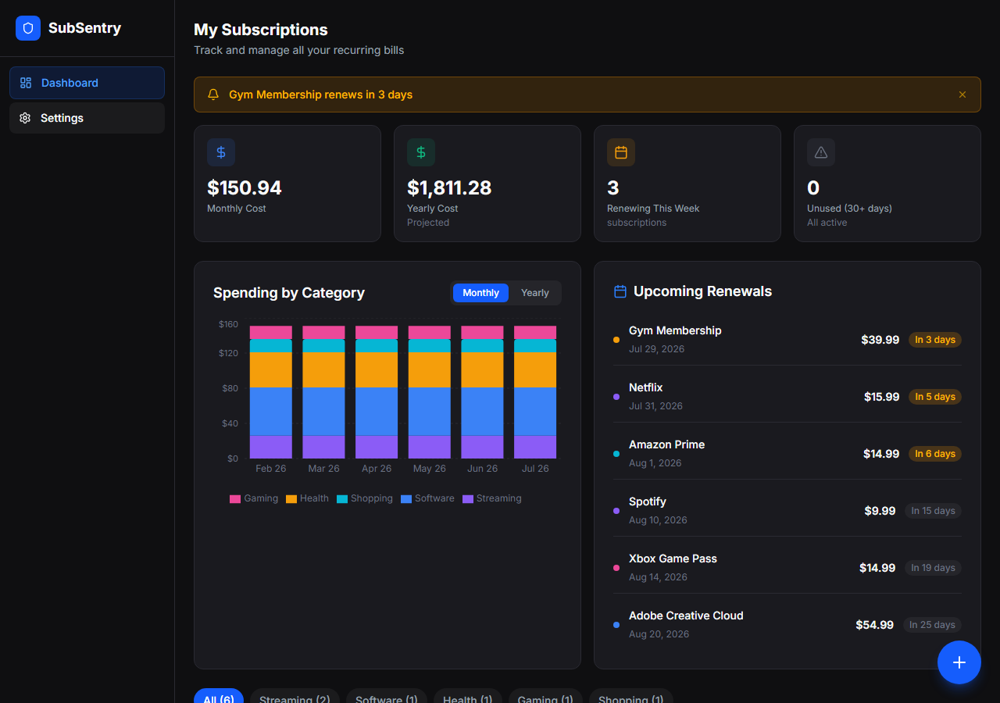
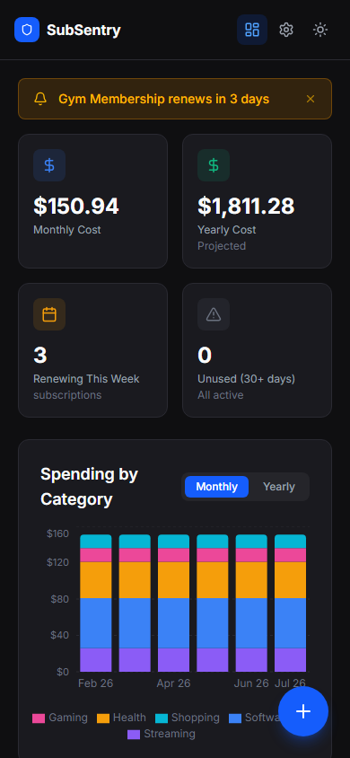

# SubSentry 🛡️

> **Offline-first subscription & bill tracker** — know exactly what you're paying and when, even without internet.


---

## ✨ Features

- 📊 **Dashboard** — Monthly/yearly totals, renewal countdown, KPI cards
- 🔔 **Smart Alerts** — Banner warns you when a subscription renews in ≤3 days
- 🏷️ **Category Filters** — Streaming, Software, Finance, Health, Gaming, and more
- 📈 **Spending Chart** — 6-month bar chart by category with monthly/yearly toggle
- 📅 **Renewal Timeline** — Sorted upcoming renewals with countdown chips
- 💾 **Offline-First** — All data stored in IndexedDB via Dexie.js
- 📤 **CSV Export/Import** — Backup and restore your data anytime
- 🌐 **PWA** — Installable, works offline, native-app feel
- 🌍 **Multi-Currency** — USD, EUR, GBP, CAD, AUD, JPY

---

## 📸 Screenshots

| Dashboard (Dark) | Light Theme |
|---|---|
|  |  |

| Add Subscription | Settings |
|---|---|
|  |  |

| Mobile Dashboard |
|---|
|  |

---

## 🛠️ Tech Stack

| Layer | Technology |
|-------|-----------|
| Framework | React 19 + TypeScript |
| Build Tool | Vite 8 |
| Styling | TailwindCSS 4 |
| Database | Dexie.js (IndexedDB) |
| Charts | Recharts |
| Icons | Lucide React |
| PWA | vite-plugin-pwa + Workbox |

---

## 🚀 Getting Started

### Prerequisites
- Node.js 18+ or Bun

### Install & Run

```bash
# Clone the repo
git clone https://github.com/yourusername/subsentry.git
cd subsentry

# Install dependencies
bun install
# or: npm install

# Start dev server
bun run dev
# or: npm run dev
```

Open [http://localhost:5173](http://localhost:5173)

### Build for Production

```bash
bun run build
# or: npm run build
```

Output goes to `dist/`. Includes PWA service worker and manifest.

### Preview Production Build

```bash
bun run preview
```

---

## 📂 Project Structure

```
src/
├── db/
│   └── db.ts              # Dexie database schema
├── types/
│   └── index.ts           # TypeScript interfaces
├── components/
│   ├── Layout.tsx          # App shell with sidebar
│   ├── Dashboard.tsx       # Main dashboard
│   ├── SubscriptionCard.tsx # Card component
│   ├── AddSubModal.tsx     # Add/edit modal form
│   ├── SpendingChart.tsx   # Recharts bar chart
│   ├── RenewalTimeline.tsx # Upcoming renewals
│   ├── AlertBanner.tsx     # Renewal alerts
│   ├── SettingsPage.tsx    # Settings & data management
│   └── EmptyState.tsx      # First-run empty state
├── hooks/
│   ├── useSubscriptions.ts # CRUD with Dexie live queries
│   ├── useAlerts.ts        # Alert computations
│   ├── useSpending.ts      # Spending aggregations
│   └── useSettings.ts      # Persistent settings
├── utils/
│   ├── dates.ts            # Date helpers & formatters
│   ├── csv.ts              # CSV export/import
│   └── categories.ts       # Category definitions + sample data
├── App.tsx
├── main.tsx
└── index.css
```

---

## 📄 License

MIT © 2026
